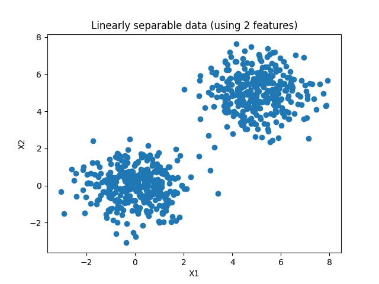
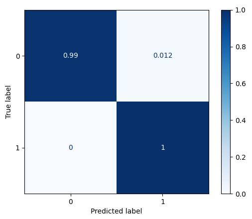

# SVM-classifier
This is step-by-step a practice to create a simple SVM classifier for a binary classification scenario using Scikit-learn.
## Steps
### (1) Generating a dataset

### (2) Building the SVM classifier
- Choosing a kernel function  
- Fitting training data to the classifier  
### (3) Using SVM to predict new data samples
- Predicting new data samples
- Evaluate the classifier with the test set. In this case, we did so by means of a **confusion matrix**, which shows us the correct and wrong predictions in terms of **true positives, true negatives, false positives and false negatives** 

### (4) Finding the support vectors of your trained SVM: as we know, support vectors determine the decision boundary. But given your training data, which vectors were used as a support vector? We can find out – and we will show you.
(4) Visualizing the decision boundary: by means of a cool extension called Mlxtend, we can visualize the decision boundary of our model. We’re going to show you how to do this with your binary SVM classifier.
evaluate your binary SVM classifier.
