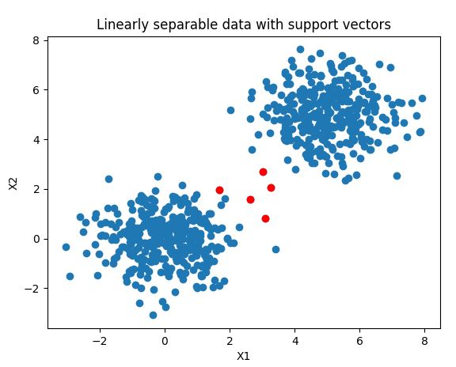
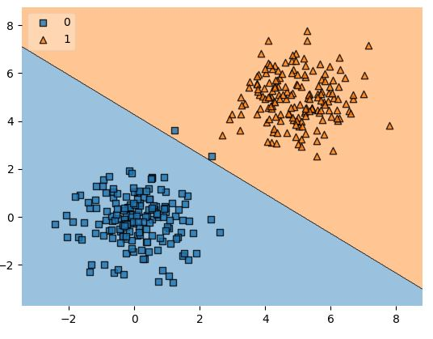

# SVM-classifier
This is a step-by-step practice to create a simple SVM classifier for a binary classification scenario using Scikit-learn.
## Steps
### (1) Generating a dataset
 
### (2) Building the SVM classifier
- Choosing a kernel function  
- Fitting training data to the classifier  
### (3) Using SVM to predict new data samples
- Predicting new data samples
- Evaluate the classifier with the test set. In this case, I did so by means of a **confusion matrix**, which shows us the correct and wrong predictions in terms of **true positives, true negatives, false positives and false negatives** 
 
In my case, I have 99% true positives and 100% true negatives, and 1.2% wrong predictions.
### (4) Finding the support vectors of the trained SVM
The decision boundary is determined by “support vectors” 
 
The linear separability of our dataset ensures that only limited support vectors are necessary to make the separation with highest margin 

### (5) Visualizing the decision boundary
This can be done by means of a cool extension called Mlxtend 
 
